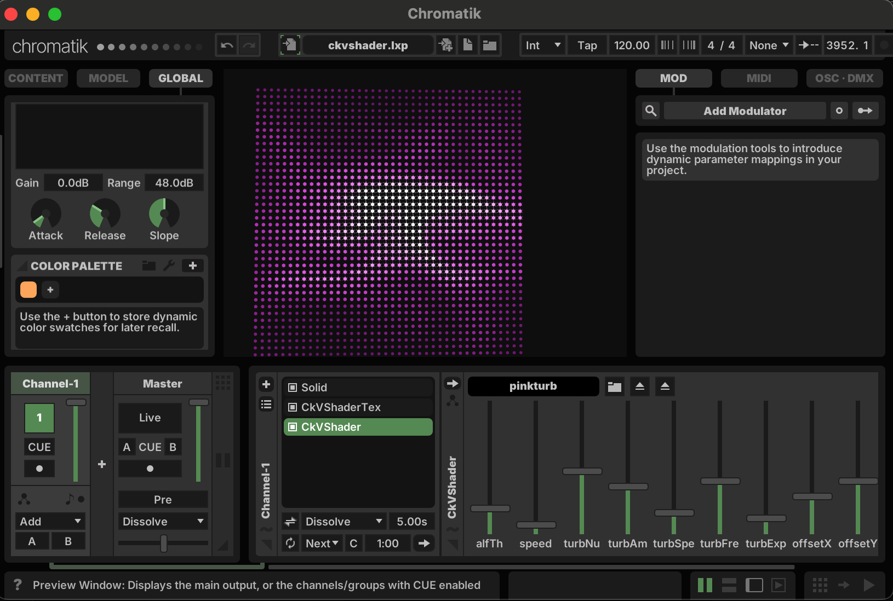

# CkVShader

A Chromatik/LX package that enables vertex shader-based volumetric rendering for LED installations. CkVShader provides GPU-accelerated lighting effects using OpenGL shaders with support for Interactive Shader Format (ISF) metadata parsing.



## Features

- **Vertex Shader Processing**: GPU-accelerated LED point rendering with transform feedback
- **ISF Support**: Interactive Shader Format with JSON metadata for dynamic parameters
- **Shader Caching**: Binary shader program caching for optimal performance
- **Audio Integration**: Audio texture generation from LX audio meter (CkVShaderTex)
- **Modular Development**: `#include` directive preprocessing for shader modularity
- **Dynamic Parameters**: Automatic UI generation from shader ISF metadata

## Quick Start

Learn to code in LX via the [Chromatik Developer Guide &rarr;](https://chromatik.co/develop/)

## Architecture

### Core Components

- **CkVShader**: Main vertex shader pattern with ISF parameter parsing and shader caching
- **CkVShaderTex**: Texture-enabled vertex shader pattern with audio texture support  
- **GLUtil**: OpenGL utilities, shader compilation, and file loading with `#include` preprocessing
- **ShaderCache**: Compiled shader caching system for performance optimization

### File Structure

- **Shaders**: `~/Chromatik/CkVShader/*.vtx` - Vertex shader files with ISF metadata
- **Textures**: `~/Chromatik/CkVShader/textures/*.png` - Image resources for texture patterns
- **Cache**: `~/Chromatik/CkVShader/cache/` - Binary shader program cache

### ISF Shader Format

Shaders support Interactive Shader Format with JSON metadata:

```glsl
/*{
  "INPUTS": [
    {"NAME": "param1", "TYPE": "float", "DEFAULT": 1.0, "MIN": 0.0, "MAX": 10.0}
  ]
}*/
```

### Building and Installation

Packages are distributed as a JAR file containing all of the above components.

- Build with `mvn package`
- Install with `mvn install`
- Install to Chromatik package folder with `mvn -Pinstall install`

_Note that `mvn -Pinstall install` does **not** automatically copy static files from [`src/main/resources`](src/main/resources) into your root `~/Chromatik` folder. You can either perform this step manually, or by importing the package using the Chromatik UI._

### Need Help?

Join us on [Discord &rarr;](https://chromatik.co/discord)

Or send an email to [support@chromatik.co](support@chromatik.co)
